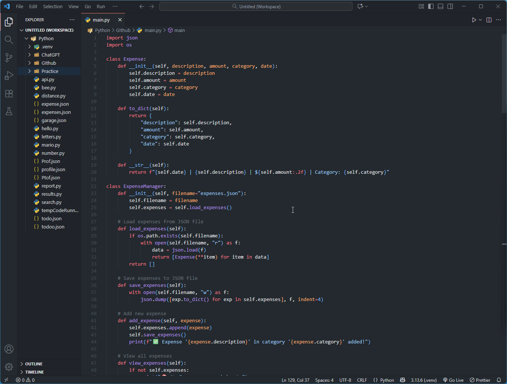

# Expense Tracker

A **Python CLI Expense Tracker** to help you manage and analyze your expenses efficiently. This app allows you to **add, view, search, edit, and delete expenses**, as well as see **total spending overall and by category**. Data is stored in a JSON file for persistence.

---

## Features

- ✅ Add new expenses with description, amount, category, and date  
- ✅ View all expenses in a clean tabular format  
- ✅ Search expenses by keyword or category  
- ✅ Edit or modify existing expenses  
- ✅ Delete expenses  
- ✅ Calculate total spending  
- ✅ Summary of total spending by category  
- ✅ Persistent storage using JSON  

---

## Requirements

- Python 3.x  
- No additional packages required  

---

## How to Run

1. Clone the repository:
bash
git clone https://github.com/yourusername/Expense-Tracker.git
cd Expense-Tracker

## 🎬 Demo
Here’s a short demo of the Expense Tracker in action:

